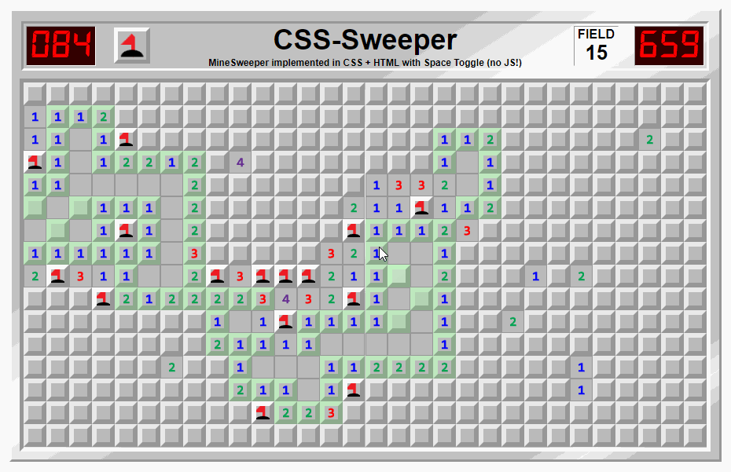

# Fyrirlestur — CSS

## Vefforritun 1 — TÖL107G

### Ólafur Sverrir Kjartansson, [osk@hi.is](mailto:osk@hi.is)

---

## Hvað er CSS?

* [Cascading Style Sheets](http://en.wikipedia.org/wiki/Cascading_Style_Sheets)
* CSS er style sheet language sem lýsir framsetningu á skjali skrifuðu í markup language, t.d. HTML, XHTML, XML og SVG
* Hannað til að aðskilja efni frá útliti

***

## Specification

* Staðlað af W3C
* [CSS 2.1 W3C recommendation 2011](http://www.w3.org/TR/CSS2/) þó fyrst árið 2004
* CSS level 3 (CSS3) – unnið sem [_módular_](https://www.w3.org/Style/CSS/current-work) ofan á fyrri útgáfur

***


---

> “You don't need to be a programmer or a CS major to understand the CSS specifications. You don't need to be over 18 or have a Bachelor's degree. You just need to be very pedantic, very persistent, and very thorough.”
>
> —[Understanding the CSS Specifications](http://www.w3.org/Style/CSS/read)

***

> Think for a moment of all the sites out there on the web. There’s a huge variation in visual style: colour schemes, typographic treatments, textures and layouts. All of that variety is made possible by one simple pattern that describes all the CSS ever written:
>
>`selector { property: value; }`
>
> That’s it.
>
> — [Resilient Web Design – Chapter 2](https://resilientwebdesign.com/chapter2/)

***

## CSS er einfalt, ekki auðvelt

* Mjög einföld málfræði í grunninn
* Verður hratt flókið, búið ykkur undir það
  * Verið óhrædd við að spyrja
* Þolinmæði og ákveðni hjálpa

***


***


***

## CSS er einfalt, en kröftugt

* Þrátt fyrir einfalda málfræði í grunninn er CSS mjög kröftugt
* Flest þau útlit sem við sjáum á vefnum eru smíðuð með CSS
* Þið getið smíðað þau líka!

***

[](https://github.com/propjockey/css-sweeper)

***

[](https://github.com/cyanharlow/purecss-francine)

---

## Tenging við html

Í æskilegri röð:

1. Vísa í skrá (`.css` ending): `<link rel="stylesheet" href="...">` í `<head>` – viðhöldum algjörum aðskilnaði
2. `<style>` blokk í HTML skjali, helst í `<head>` – ekki alveg jafn hreint en aðskiljum þó frá markup
3. `style` attribute á element – _alls ekki_ æskilegt þar sem við erum að binda útlit við element í markup

***

## Dæmi um tengingu

* [HTML & CSS](daemi/01.html-css.html)
  * Tenging HTML & CSS, ekki gott dæmi
* [HTML & CSS](daemi/02.html-css.html)
  * Tenging HTML & CSS, betra dæmi

***

## Refactor

* Í seinna dæminu erum við búin að _refactora_ fyrra dæmið
* Breyttum uppbygginu kóðans til hins betra án þess breyta lokaniðurstöðunni

---

## Málfræði

* Vinnum með _reglusett_, samanstanda af
  * _selectors_
  * _yfirlýsingum_
* Athugasemdir eru innan `/* comment */`

***

```css
/* eftirfarandi er eitt reglusett */
p /* selector */
{ /* yfirlýsingar innan { } */
  color: green; /* yfirlýsing */
  margin: 1em; /* yfirlýsing */
}
```

***

## Selectors

* Strengur sem lýsir því hvaða element við viljum að taki við _yfirlýsingum_
  * Skiptast í sex flokka
* Getum tengt saman
  * Fjórar gerðir af samtengingum

***

## Selectors – flokkar

* [_Type selectors_](https://developer.mozilla.org/en-US/docs/Web/CSS/Type_selectors), heiti á elementi, t.d. `p`
* [_Universal selectors_](https://developer.mozilla.org/en-US/docs/Web/CSS/Universal_selectors), öll element, `*`
* [_Attribute selectors_](https://developer.mozilla.org/en-US/docs/Web/CSS/Attribute_selectors), velur element eftir attribute og innihaldi

***

* [_Class selectors_](https://developer.mozilla.org/en-US/docs/Web/CSS/Class_selectors), velur element eftir því hvað `class` attribute inniheldur, notar `.` (punkt)
* [_ID selectors_](https://developer.mozilla.org/en-US/docs/Web/CSS/ID_selectors), velur element eftir því hvað `id` attribute inniheldur
* [_Gervi-klasar_](https://developer.mozilla.org/en-US/docs/Web/CSS/Pseudo-classes) (pseudo-classes), velur hluti sem ekki er hægt að velja með hinum, notum `:`

***

## Gervi-klasar (pseudo-classes)

* Dýnamískir gerviklasar, t.d.
  * Fyrir tengla: `:link` ef ekki er búið að heimsækja og `:visited` ef búið er að heimsækja
  * Fyrir aðgerðir notenda: `:hover` meðan sveimað er yfir element, `:active` ef búið er að velja það eða smella á það, `:focus` ef það hefur fókus

***

* Gerviklasar fyrir upbyggingu
  * t.d. `:nth-child()`, `:first-child`, `:last-of-type`, eða `:empty`
* [`:not()`](https://developer.mozilla.org/en-US/docs/Web/CSS/:not) til að _neita_ ákveðnum selector, er vandmeðfarinn en leyfir flókna hegðun

***

## Selectors – samtenging

* [`" "`](https://developer.mozilla.org/en-US/docs/Learn/CSS/Building_blocks/Selectors/Combinators#descendant_combinator) (bil) þýðir að seinni selector velur element sem er afkomandi fyrri
* [`>`](https://developer.mozilla.org/en-US/docs/Web/CSS/Child_combinator) er fyrir _strangt barn_, seinni selector verður að vera barn fyrri
* [`+`](https://developer.mozilla.org/en-US/docs/Web/CSS/Adjacent_sibling_combinator) er fyrir _systkini_, seinni selector velur element sem er systkini sem kemur **beint á eftir** fyrri selector
* [`~`](https://developer.mozilla.org/en-US/docs/Web/CSS/General_sibling_combinator) er almennur systkina selector, seinni selector velur element sem er systkini fyrri

***

## `at` reglur

* [`at` reglur](https://developer.mozilla.org/en-US/docs/Web/CSS/At-rule) leyfa skilgreiningar á aukaupplýsingum
* Ákveðið gildi, t.d. `@import 'typography.css';` innifelur skrá
* Hreiðruð (e. nested) gildi, t.d. `@media`, sjáum betur í responsive

***

## Gervi-element (pseudo-element)

[Gervi-element](https://developer.mozilla.org/en-US/docs/Web/CSS/Pseudo-elements) leyfa okkur að velja parta af elementi sem við annars gætum ekki gert. Þau eru skilgreind í selector með `::`.

* `::before/::after` – element fyrir framan/aftan það sem skilgreint er, ekki til fyrr en við veljum
* `::first-letter` – fyrsti stafur elements
* `::first-line` – fyrsta lína elements

***

## Villumeðhöndlun

* CSS er hannað til að fyrirgefa minniháttar villur, t.d.
  * Ef tvípunkt eða semíkommu vantar í yfirlýsingu
  * Ef heiti eigindis er óþekkt er yfirlýsingin öll hunsuð og haldið áfram að næstu.

***

* Meiriháttar villur stoppa lestur á skjali frá þeim stað sem þær eiga sér stað

***

## Dæmi um selectors og villumeðhöndlun

* [Dæmi um selectors](daemi/03.selectors.html)
* [Dæmi um gervi-klasa og gervi-element](daemi/04.pseudo.html)
* [Villumeðhöndlun](daemi/05.error.html)
  * Hvernig CSS bregst við ef villa er í CSS

---

## Yfirlýsingar

* Reglusett inniheldur yfirlýsingar:
* `eigindi: gildi;`
* Mjög mörg eigindi, möguleg gildi færri

***

## Shorthand

* Oft er hægt að skilgreina í einni yfirlýsingu mörg gildi fyrir svipaða virkni
* Tvíeggja sverð: getur aukið lesanleika en líka falið möguleg gildi

`margin: <top> <right> <bottom> <left>;`

---

## Gildi og einingar

* CSS hefur nokkrar mismunandi tegundir af [gildum og einingum](https://developer.mozilla.org/en-US/docs/Learn/CSS/Building_blocks/Values_and_units)
* Hvert eigindi tekur mismunandi gildi, verðum að vita hvert eða fletta því upp

***

## Gildi – strengir

* Strengir eru skilgreindir með `"` eða `'`
* Getum escapeað staf með `\` fyrir framan
* `"this is a 'string'"`
* `"this is a \"string\""`
* `'this is a "string"'`

***

## Gildi – URL

Url skilgreinum við með `url(<slóð>)` þar sem slóð er bein slóð eða slóð í streng.

* `url(http://example.org/mynd.jpg)`
* `url('http://example.org/mynd.jpg')`
* `url('/mynd.jpg')`

***

## Gildi – litir

Höfum nokkrar leiðir til [að skilgreina liti](https://developer.mozilla.org/en-US/docs/Web/CSS/color_value).

[Lykilorð](https://developer.mozilla.org/en-US/docs/Web/CSS/color_value#color_keywords), t.d. `black`, `white`, `green`

* Ekki augljóst hvaða lit er verið að meina _nákvæmlega_ svo forðumst yfirleitt
* `currentColor` er erft gildi litar sem kemur frá foreldri
* `transparent` fyrir alveg gegnsæan lit

***

RGB gildi með hexadecimal eða [`rgb()`](https://developer.mozilla.org/en-US/docs/Web/CSS/color_value/rgb()),

* t.d. `#00ff00` eða `rgb(0, 255, 0)` (bæði gildi eru grænn).
* Getum líka skilgreint í þrem tölum, þá er ein tala að túlka tvær sömu, `#0f0`
* Ef við bætum við tveim (eða einni) tölu aftast túlkum við hversu gegnsær liturinn er (`ff` ekkert gegnsær, `00` alveg gegnsær), t.d. `#00ff0066`

***

* [HSL](https://en.wikipedia.org/wiki/HSL_and_HSV) gildi með [`hsl()`](https://developer.mozilla.org/en-US/docs/Web/CSS/color_value/hsl())
* Getum skilgreint alpha gildi með `rgba()` og `hsla()`
  * Á bilinu `[0, 1]`. `0` er alveg gegnsær en `1` er ekkert gegnsær

***

## Gildi – tölur

* Heiltölur
* Rauntölur, með punkt `1.2`
* Prósentur `25.5%`

---

## Lengdir

* Nákvæmar einingar
  * t.d. `in`, `cm`
  * Notum mest `px` eða _pixel_
* Hlutfallslegar einingar
* `auto` leyfir vafra að reikna lengdina

***

## Hlutfallslegar einingar

* Letur-hlutfallslegar einingar (font-relative lengths)
* Skjá-prósentu einingar (viewport percentage lengths)

***

## Letur-hlutfallslegar einingar

* Horfa til `font-size` eigindsins
* Yfirleitt `em` eða `rem`
* Í grunninn er `1em == 16px` en getum breytt með að setja `font-size` á `html`

***

* Þegar reiknað er úr `em` gildum í elementum sem eiga sér foreldri með skilgreint `em` gildi eru þau _margfölduð_.
* Á ekki við `rem`

***

## Dæmi

* [Dæmi um letur-hlutfallslegar einingar](daemi/06.em.html)

***

## Skjá-prósentu einingar

* Hlutfallslegar við stærð _viewports_ sem er yfirleitt stærð vafragluggans.
* `vw` er ein eining á breiddina (_viewport width_) svo `100vw` myndi fylla upp í skjá á breiddina
* `vh` er ein eining á hæðina (_viewport height_) svo `100vh` myndi fylla upp í skjá á hæðina

***

* `1vmin` er `1vw` eða `1vh`, hvort sem er minna
* `1vmax` er `1vw` eða `1vh`, hvort sem er stærra

[Dæmi um skjá-prósentu einingar](daemi/07.vh-vw.html)
