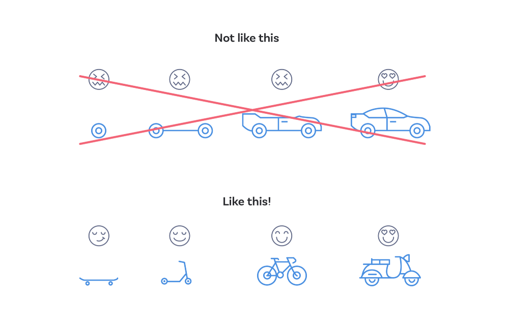

# Fyrirlestur — CSS stuðningur

## Vefforritun 1 — TÖL107G

### Ólafur Sverrir Kjartansson, [osk@hi.is](mailto:osk@hi.is)

---

## Progressive enhancement

* Upplifun sem krefst minnstu mögulegrar tækni
* Bætum virkni við eins og stuðningur er til staðar
* Byrjum einfalt og bætum við virkni í lögum

***

1. Skrifum áhugavert, skýrt efni
2. Setjum það upp með aðgengilegu, merkingarfræðilegu HTML
3. Bætum við grunn útliti sem er vel stutt
4. Bætum við flóknara útliti sem er e.t.v. minna stutt
5. Bætum við aukinni virkni með JavaScript

***



***

## Fallback

* Ný eigindi eða gildi leyfa okkur að gera eitthvað skemmtilegt
* En hvað ef það eru ekki allir vafrar farnir að styðja eigindið?
* Skilgreinum _fallback_ gildi sem við erum nokkuð viss um að sé stutt

***

```css
width: 99%; /* fallback */
width: calc(100% - 30px);
```

***

## calc

* [`calc()`](https://developer.mozilla.org/en-US/docs/Web/CSS/calc()) er fall sem leyfir reikninga með mismumandi einingar
* `calc(50% - 2px);`, `2px` dregnir frá `50%` þegar notað gildi er fundið

***

## Vafraforskeyti

* Meðan vafri er ekki með fullkominn stuðning við staðal eru vafraforskeyti (vendor prefixes) oft notuð til að bjóða upp á stuðning.
* Ekki notað á nýrri virkni en enn til staðar fyrir suma virkni

***

* Minni og minni þörf, þurfum _yfirleitt_ ekki en fer eftir því hvaða vafra við ætlum að styðja og hversu gamlar útgáfur af þeim
* Æskilegt að nota sjálfvirk tól til að sjá um, t.d. [_autoprefixer_](https://autoprefixer.github.io/)

***

```css
display: flex;
user-select: none;
```

verður með autoprefixer fyrir fjórar seinustu útgáfur af vöfrum:

```css
display: -webkit-box;
display: -ms-flexbox;
display: flex;
-webkit-user-select: none;
-moz-user-select: none;
-ms-user-select: none;
user-select: none;
```

***

## Hvað getum við notað?

* Hvaða vafrar styðja hvað af CSS?
* [caniuse.com](http://caniuse.com/) hefur yfirgripsmikinn gagnagrunn yfir stuðning vafra á ákveðinni virkni

***

## Feature queries

* [Feature queries](https://developer.mozilla.org/en-US/docs/Web/CSS/CSS_Conditional_Rules/Using_Feature_Queries) er nýleg leið til að athuga hvort vafri styðji eigindi og gildi
* Hreiðraðar CSS reglur eru notaðar ef stuðningur fyrir hendi
* Notum fyrir nýja virkni sem þarf meira en bara fallback gildi

***

```css
@supports (writing-mode: vertical-lr) {
  h1 {
    float: left;
    writing-mode: vertical-lr;
  }
  /*
  ef vafri styður writing-mode er
  h1 lóðrétt vinstra megin
  */
}
```

***

## Shim & polyfill

* Shim (eða shiv) er virkni sem „stungið“ er inn og veitir virkni frá nýju API í gömlu umhverfi
* Polyfill er kóði eða plugin sem veitir þér aðgang að virkni sem þú gerir ráð fyrir að vafrinn bjóði upp á. Þ.e.a.s. shim fyrir vafra API
* [HTML5 Cross Browser Polyfills](https://github.com/Modernizr/Modernizr/wiki/HTML5-Cross-Browser-Polyfills)

***

## Að skrifa CSS

* Notum _í dag_ virkni sem verður ekki að fullu studd í öllum vöfrum fyrr en _í framtíðinni_
* Ákveðum hvaða vafra og stýrikerfi við ætlum (eða ætlum ekki að styðja)
* Prófum í viðeigandi tækjum
* Nýtum okkur _progressive enhancement_

---

## CSS variables

* [CSS variables](https://developer.mozilla.org/en-US/docs/Web/CSS/Using_CSS_custom_properties) (eða custom properties) leyfa okkur að skilgreina breytur
  * t.d. fyrir lit, ákveðna lengd eða eitthvað annað sem er mikið notað
* Breytingar verða auðveldari og getur bætt lesanleika

***

* Skilgreinum með `--<heiti>: gildi;`
* Notum með [`var()`](https://developer.mozilla.org/en-US/docs/Web/CSS/var()) fallinu
* Ef ekki skilgreind getum við sent aðra færibreytu sem  _fallback_ gildi, `var(<breyta>, #000)`

***

* Breytur sem skilgreindar eru munu erfast frá foreldri til barns og eru háðar _cascade_
* Getum skilgreint breytur efst í trénu með `:root` gerviklasanum
* Getum notað breytur með `calc()`, t.d. `calc(var(--multiplier) * 1em)`

[Dæmi](daemi/01.variables.html)

***

## env() gildi

* Sumir vafrar skilgreina [`env()`](https://developer.mozilla.org/en-US/docs/Web/CSS/env()) gildi eftir því í hvaða umhverfi eða stýrikerfi er verið að keyra
* T.d. þarf að gera ráð fyrir „öruggu“ svæði þegar eitthvað er birt? „Notch“ á símum, eða neðri stika á iOS Safari.
* `env(safe-area-inset-bottom)` gefur okkur gildi sem hægt er að bæta við með `calc()` til að efnið okkar sjáist.

---

## Logical properties

* [Logical properties](https://developer.mozilla.org/en-US/docs/Web/CSS/CSS_Logical_Properties/) er þegar við notum _logical_ gildi en ekki _physical_ gildi til að skilgreina eigindi
* _Physical_ gildi er t.d. `bottom` eða `left`, og takmarkast af samhengi—í flestum tilfellum er það samhengi að við séum að lesa frá vinstri til hægri
* _Logical_ gildi eru ekki fest með nákvæmum gildum heldur vinna útfrá `block` og `inline`

***

* `margin-inline` vísar í `left` og `right` ef við lesum frá vinstri-til-hægri, öfugt ef lesið frá hægri-til-vinstri, og vísa í `top`  og `bottom` ef lesið frá topp til botns
* `padding-inline-start` og `padding-inline-end`, o.s.fr.
* Tengist því hvernig flexbox virkar

---

## border-radius

* Hægt er að rúna horn á boxi með [`border-radius`](https://developer.mozilla.org/en-US/docs/Web/CSS/border-radius)
* Hvort sem `border` er skilgreint eða ekki
* Ef við skilgreinum eina tölu er miðað við hringlaga horn en tvær tölur miða við sporöskjulaga horn
* [border-radius generator frá Mozilla](https://developer.mozilla.org/en-US/docs/Web/CSS/CSS_Background_and_Borders/Border-radius_generator)

[Dæmi](daemi/02.border-radius.html)

***

## box-shadow

* Getum skilgreint einn eða fleiri skugga á boxum með [`box-shadow`](https://developer.mozilla.org/en-US/docs/Web/CSS/box-shadow)
* Utan (`outset`, sjálfgefið gildi) eða innan boxsins (`inset`)
* [box-shadow generator frá Mozilla](https://developer.mozilla.org/en-US/docs/Web/CSS/CSS_Box_Model/Box-shadow_generator)

[Dæmi](daemi/03.box-shadow.html)

***

## CSS shapes

* Leið til að brjótast út úr boxunum með [`shape-outside`](https://developer.mozilla.org/en-US/docs/Web/CSS/shape-outside)
* Skilgreinum hvernig inline element leggjast upp að boxinu okkar
* Setjum form eða notum _alpha channel_ (gegnsæi) á mynd

[Dæmi](daemi/04.shapes.html)

***

## object-fit

* Stýrum því hvernig innfellt efni (t.d. mynd) er meðhöndlað með [`object-fit`](https://developer.mozilla.org/en-US/docs/Web/CSS/object-fit)
* `fill`, sjálfgefið, fyllir algjörlega út í foreldi
* `cover`, hlutur fyllir út í box en stærðarhlutföllum er haldið, ef hlutur passar ekki er klippt af honum

***

* `contain`, hlutur fyllir út í box en stærðarhlutföllum er haldið, ef hlutur passar ekki er hann skalaður, getur myndast „letterbox“
* `none`, ekkert er átt við hlut

[Dæmi](daemi/05.object-fit.html)

***

## clip-path

* [clip-path](https://developer.mozilla.org/en-US/docs/Web/CSS/clip-path) býr til „klippt svæði“ eftir skilgreindri braut
* Getum skilgreint sem `circle`, `ellipse`, `polygon`, eða `path` sem getur notað SVG skilgreiningu fyrir flókin form

[Dæmi](daemi/06.clip-path.html)
