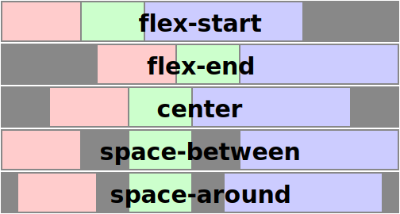

# Fyrirlestur — Flexbox

## Vefforritun 1 — TÖL107G

### Ólafur Sverrir Kjartansson, [osk@hi.is](mailto:osk@hi.is)

---

## Layout

* Kom snemma í ljós að `position` og `float` var ekki nóg til að gera flókin útlit
  * Sérstaklega ekki ef það á að vera sveigjanlegt
* Flexbox er leið til að gera „alvöru“ layout í CSS

***

## Flexbox

* Segjum foreldri að raða börnum sínum með flexbox með [`display: flex`](https://developer.mozilla.org/en-US/docs/Learn/CSS/CSS_layout/Flexbox)
  * Eða `display: inline-flex` til að raða foreldri inline
* Element með `display: flex` eru kölluð _flex containers_
* Börn innan flexbox eru kölluð _flex items_

***

## Flex items

* `margin` á flex items _gleypir_ auka pláss á alla kanta
  * `margin: auto;` virkar eins og við myndum gera ráð fyrir—á alla kanta
* Börnum er raðað eftir skilgreiningar röð í HTML, getum breytt með [`order`](https://developer.mozilla.org/en-US/docs/Web/CSS/order)
  * Hærri tala lætur raðast seinna
  * Sjálfgefið `order: 0;`

***

## Dæmi

* [`flex` og `inline-flex`](daemi/3.flexbox/01.inline-flex.html)
* [Fullkomlega miðjað](daemi/3.flexbox/02.bullseye.html)

---

## Ásar

***

* Höfum skilgreinda tvo ása
  * [Aðalás (main axis)](https://developer.mozilla.org/en-US/docs/Glossary/Main_Axis)
  * [Krossás (cross axis)](https://developer.mozilla.org/en-US/docs/Glossary/Cross_Axis)
* Hornréttir hvor á annan

***

[`flex-direction`](https://developer.mozilla.org/en-US/docs/Web/CSS/flex-direction) skilgreinir aðalás

* `row`, sjálfgefið gildi, aðalás frá vinstri til hægri (eða hægri til vinstri ef texti er lesinn þannig)
* `row-reverse`, aðalás frá hægri til vinstri
* `column`, krossás (m.v. `row`) verður skilgreindur sem aðalás og öfugt. Aðalás frá toppi til botns
* `column-reverse`, eins og `column` en aðalás frá botni til tops

***

***

## Flex-línur

* Sjálfgefið er öllum flex itemum troðið á aðalás og þau minnka í samræmi til að fá pláss
* [`flex-wrap`](https://developer.mozilla.org/en-US/docs/Web/CSS/flex-wrap) breytir þessari hegðun:
  * `nowrap`, sjálfgefið, ekki flæða í nýja línu
  * `wrap`, ef það er ekki pláss, flæða í nýja línu (vinstri hægri eða hægri vinstri)
  * `wrap-reverse`, eins og wrap en í öfugri röð

***

## `justify-content`

[`justify-content`](https://developer.mozilla.org/en-US/docs/Web/CSS/justify-content) skilgreinir hvernig flex item er raðað á aðalás

* `flex-start`, sjálfgefið, raðar við byrjun á ás
* `flex-end`, raðar við enda á ás

***

* `center`, raðar fyrir miðju áss
* `space-between`, dreifir plássi _milli_ flex itema
* `space-around`, dreifir plássi milli _og utanum_ flex flex item

***

***

## `align-content`

[`align-content`](https://developer.mozilla.org/en-US/docs/Web/CSS/align-content) skilgreinir staðsetningu _innan línu_ á krossás

* `stretch`, sjálfgefið, jafnar við stærstu línu
* `flex-start`, byrjun línu

***

* `flex-end`, enda línu
* `center`, miðju línu
* `baseline`, jöfnuð við _baseline_

***

***

## Dæmi um staðsetningu og raðir

* [Staðsetning](daemi/3.flexbox/03.position.html)
* [Raðir](daemi/3.flexbox/04.row.html)

---

## `align-self`

* Með [`align-self`](https://developer.mozilla.org/en-US/docs/Web/CSS/align-self) getur hvert og eitt flex item skilgreint hvernig það hagar sér m.t.t. `align-items`
* Getum látið ákveðin flex item standa útúr

***

## `align-items`

[`align-items`](https://developer.mozilla.org/en-US/docs/Web/CSS/align-items) breytir staðsetningu _lína_ á krossás, aðeins ef `flex-wrap` er ekki `no-wrap`

* `stretch`, sjálfgefið, línur teygðar til að taka allt pláss
* `flex-start`, raðar við byrjun á ás
* `flex-end`, raðar við enda á ás

***

* `center`, raðar fyrir miðju áss
* `space-between`, dreifir plássi _milli_ flex itema
* `space-around`, dreifir plássi milli _og utanum_ flex item

***

***

## Stærðir

* Við getum stýrt því hvernig flex item taka pláss innan flexbox með [`flex-grow`](https://developer.mozilla.org/en-US/docs/Web/CSS/flex-grow), [`flex-shrink`](https://developer.mozilla.org/en-US/docs/Web/CSS/flex-shrink) og [`flex-basis`](https://developer.mozilla.org/en-US/docs/Web/CSS/flex-basis)
* `flex-grow` er rauntala, stærri en 0 og skilgreinir hvernig flex item stækkar í hlutfalli við önnur flex item, sjálfgefið er `0`. „growth factor“

***

## `flex-grow`

* Ef öll hafa `1` taka þau öll jafnt pláss
* Ef eitt hefur 2 en önnur 1, fær eitt tvisvar sinnum meira pláss (eins og hægt er) en hin rest, jafnt
* Ef aðeins eitt hefur `flex-grow` skilgreint tekur það allt pláss sem önnur flex item þurfa ekki

***

* `flex-shrink` er skilgreint eins og `flex-grow` en stýrir því hvern flex item minnkar, sjálfgefið er `1`
* `flex-basis` skilgreinir upphafsstærð á flex item, áður en plássi er dreift til flex itema, sjálfgefið er `auto`
* [`flex`](https://developer.mozilla.org/en-US/docs/Web/CSS/flex) er shorthand fyrir þessi þrjú eigindi, notum það yfirleitt þar sem það setur hin eigindin „rétt“ m.v. gildi

***

## Stærðir – `flex`

* `initial`, sjálfgefið, flex item minnka ef ekki er nóg pláss en stækka ekki umfram `width` og `height`
* `auto`, stærð skv. `width` og `height` en stækkar til að fá auka pláss í flexboxi
* `none`, flex item stækka hvorki né minnka
* `<tala>`, tilgreinir hlutfall sem flex item fær af plássi, `grow`

***

* `<tala> <tala>`, setur `grow` og `shrink` faktor
* `<tala> <tala> <tala>` setur `grow`, `shrink` og `basis`
* `flex: 1 0 300px;`
  * Upprunalega á að reikna stærð sem 300px, þessi stærð má aukast en hún má ekki minnka

***

## Dæmi um flex items

* [Flex items](daemi/3.flexbox/05.items.html)

***

## Flex og útlit

* Notum flexbox héðan í frá til að sjá um útlit
  * Með hjálp frá grid sem við sjáum í næstu viku
* Með því að nota flexbox ítrekað getum við útfært flókin útlit með nokkrum eigindum

[Flex dæmi](daemi/3.flexbox/06.flex.html)
