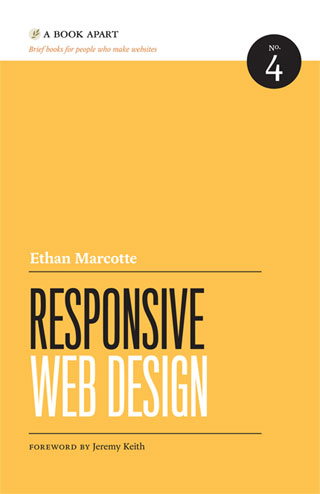
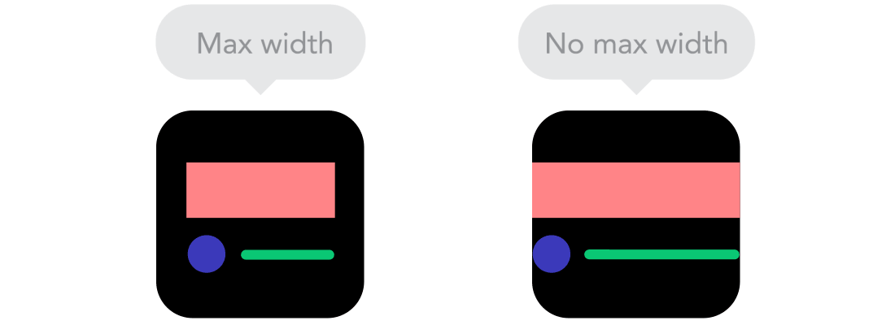

# Fyrirlestur — Skalanleg vefhönnun

## Vefforritun 1 — TÖL107G

### Ólafur Sverrir Kjartansson, [osk@hi.is](mailto:osk@hi.is)

---

## Skalanleg vefhönnun

***


***


***


***

## Einu sinni...

* 640 x 480
* 800 x 600
* 1024 x 768

***

> If you’ve ever used Photoshop then you’ll know what happens when you select “New” from the “File” menu: you will be asked to enter fixed dimensions for the canvas you are about to work within. Before adding a single pixel, a fundamental design decision has been made that reinforces the consensual hallucination of an inflexible web.
>
> — [Resilient Web Design, chapter 3: Visions](https://resilientwebdesign.com/chapter3/)

***

<div style="float: left; margin-right: 2%; width: 22%">
  1680×945<br>
  1680×1050<br>
  1600×900<br>
  1600×768<br>
  1600×1200<br>
  1440×900<br>
  1400×1050<br>
  1366×768<br>
  1366×720<br>
  960×540<br>
  854×480<br>
  800×480<br>
</div>
<div style="float: left; margin-right: 2%; width: 22%">
  1280×854<br>
  1280×800<br>
  1280×768<br>
  1280×720<br>
  1280×1024<br>
  1200×824<br>
  1152×768<br>
  1024×768<br>
  1024×600<br>
  2048×1536<br>
  2048×1152<br>
  2048×1050<br>
</div>
<div style="float: left; margin-right: 2%; width: 22%">
  420×293<br>
  3840×2400<br>
  352×416<br>
  320x480<br>
  320×240<br>
  272×480<br>
  2560×1600<br>
  2560×1440<br>
  240×320<br>
  640×480<br>
  640×360<br>
  600×800<br>
</div>
<div style="float: left; margin-right: 2%; width: 22%">
  640x960<br>
  640x480<br>
  640×96<br>
  176×220<br>
  176×208<br>
  176×132<br>
  480×800<br>
  480×640<br>
  480×272<br>
  480×1024<br>
  720×480<br>
  720×1280<br>
</div>

***

> Relinquishing control does not mean relinquishing quality. Quite the opposite. In acknowledging the many unknowns involved in designing for the web, designers can craft in a resilient flexible way that is true to the medium.
>
> —[Resilient Web Design, chapter 3: Visions](https://resilientwebdesign.com/chapter3/)

***



***

* _Responsive web design_
* Ethan Marcotte skrifaði [grein á A List Apart 2010](http://alistapart.com/article/responsive-web-design) sem skilgreindi skalanlega vefhönnun
* Gaf út bókina [árið 2011 hjá A Book Apart](http://abookapart.com/products/responsive-web-design)

***

Byggir á, í mikilvægis röð:

1. Sveigjanlegu umbroti, byggðu á grind
2. Sveigjanlegum myndum og miðlum
3. CSS media queries

***

* Birtum...
  * sama efnið...
  * með sama HTML...
  * á sömu slóð..
  * en! aðlögum okkur að tæki

***

> “Responsive Web Design: Serves the same HTML code on the same URL regardless of the users' device (for example, desktop, tablet, mobile, non-visual browser), but can render the display differently based on the screen size. Google recommends Responsive Web Design because it's the easiest design pattern to implement and maintain.”
>
> —Google – [Mobile SEO Overview](https://developers.google.com/search/mobile-sites/mobile-seo)

***

## Mobile First

* [Luke Wroblewski](http://www.lukew.com/) gaf út [bók hjá A Book Apart 2010](https://abookapart.com/products/mobile-first) um _mobile first_
* Hugtak tengt skalanlegri vefhönnun
* Byrjum á að einblína á efnið og verkefnin, ekki útlitið

***

## Mobile first

* Byrjum á upplifun í minni tækjum
* Neyðir þig til að taka ákvarðanir
* Efnið í fyrirrúmi, ekki óþarfa „skraut”
* Progressive enhancement!

***

> “The web’s greatest strength, I believe, is often seen as a limitation, as a defect. It is the nature of the web to be flexible, and it should be our role as designers and developers to embrace this flexibility, and produce pages which, by being flexible, are accessible to all.”
>
> —John Allsopp – [A Dao of Web Design](http://alistapart.com/article/dao)

***

> “The primary design principle underlying the Web’s usefulness and growth is universality. […] And it should be accessible from any kind of hardware that can connect to the Internet: stationary or mobile, small screen or large.”
>
> —Tim Berners-Lee — [Long Live the Web](https://www.scientificamerican.com/article/long-live-the-web/)

---

## Tæknilegt

***

Byggir á:

1. Sveigjanlegu umbroti, byggðu á grind
2. Sveigjanlegum myndum og miðlum
3. CSS media queries

***

## Sveigjanleg grind

* __Notum hlutfallsleg gildi, ekki nákvæm__
* Ef umgjörð minnkar, þá minnkar allt hlutfallslega innan hennar
* Getum fest umgjörðina til að festa allt innihald
* Notum yfirleitt `max-width` á umgjörð til að setja hámarksbreidd

***


***



Myndir frá [9 basic principles of responsive web design](http://blog.froont.com/9-basic-principles-of-responsive-web-design/)

***

## Útreikningar

* Með því að nota
  * `target ÷ context = result`
* Getum við breytt úr nákvæmu gildi í hlutfallslegt fyrir breiddir, margin, padding og letur
* Notum því prósentur
  * Einnig væri hægt að nota `em`

***

* T.d. erum með `1600px` umgjörð og innan hennar `1200px` efnissvæði
* Í staðinn fyrir `px` (nákvæm stærð) notum við hlutfall í prósentum
  * `1200 ÷ 1600 = 0,75` eða `75%`

***

## Grind

* Skilgreinum fjölda dálka (columns) sem við vinnum með, _cols_
* Skilgreinum hugsanlega raðir, _rows_
* _Gutter_ er plássið á milli dálka (og hugsanlega raða ef við skilgreinum)

***

Getum skilgreint með flexbox og margin æfingum:

* Notum neikvæð `margin-left` og `margin-right` upp á hálft gutter
* Notum hálft gutter í `padding-left`  og `padding-right` á hvern dálk
  * Dreifum gutter jafnt milli dálka

***

* `box-sizing: border-box;` er lykill til að láta ganga
* Getum notað `margin-left` og `margin-right` til að færa efni til í dálkum

***

Eða notað CSS grid! Skoðum nánar í næsta fyrirlestri.

[Dæmi um flexbox grind með margins](daemi/01.grid.html)

***

## Sveigjanlegar myndir og miðlar

* Getum fest við umgjörð þeirra og látið skalast
  * `max-width: 100%;` á `img` passar að mynd fylli alltaf út í foreldi sitt
* Getum bæði minnkað/stækkað eða _kroppað_
  * `object-fit` hjálpar til
* [Dæmi](daemi/02.object-fit-rwd.html)

***

## Stærðarhlutföll

* Ef við viljum viðhalda stærðarhlutföllum (aspect ratio) á efni höfum við „trikk“
* gervi-element, barn sem fyllir upp í foreldri sitt og `padding-top`
* Eða notað nýlegt (og ekki full stutt eigindi) [`aspect-ratio`](https://developer.mozilla.org/en-US/docs/Web/CSS/aspect-ratio)

[Dæmi](daemi/03.aspect-ratio.html)

***

## Media queries

* Ákveðum „brotpunkta“ í hönnun og breytum flæði miðað við **stærð vafraglugga**
* Stillum [media query](https://developer.mozilla.org/en-US/docs/Web/CSS/Media_Queries), t.d.
  * `max-width` – skilgreinum reglur upp að þeirri vídd
  * `min-width` – skilgreinum reglur frá þeirri vídd
  * Hægt að `and`-a saman en gerum sjaldan—reynum að halda einföldu

***

## Media queries & progressive enhancement

* Að nýta sér mobile first hugsun þýðir að við skilgreinum í grunninn hvernig hlutur fyllir alveg út í pláss sitt
* Eftir því sem meira pláss er til staðar tekur hlutur minna pláss
* Byrjum í „mobile“

***

```css
/* almennt er section 100% breitt */
section {
  width: 100%;
}

/* frá 800px breiðum viewport er
   section 50% breitt */
@media (min-width: 800px) {
  section {
    width: 50%;
  }
}
```

***

## Container queries

* [Container queries](https://developer.mozilla.org/en-US/docs/Web/CSS/CSS_Container_Queries) eru á leiðinni!
* Leið til að stjórna hegðun byggt á **lausu plássi**
* „Hefur þetta box a.m.k. `1000px` til að vinna með?“ o.s.fr.

***

## Clamp

* Þegar við útfærum skalanlega vefi viljum við stundum að gildi skalist línulega
* Ekki í discrete stökkum milli skilgreindra media queries
* [`clamp()`](https://developer.mozilla.org/en-US/docs/Web/CSS/clamp()) er fall sem við getum notað með neðri mörkum, reiknuðu gildi, og efri mörkum

```css
font-size: clamp(1rem, 16px + 1vw, 4rem);
```

***

Getum líka gert með aðeins flóknari aðferð sem kölluð er [_fluid typography_](https://css-tricks.com/snippets/css/fluid-typography/).

```css
html { font-size: 16px }
@media screen and (min-width: 320px) {
  html {
    font-size: calc(16px + 6 * ((100vw - 320px) / 680));
  }
}
@media screen and (min-width: 1000px) {
  html {
    font-size: 22px;
  }
}
```

***

* [Dæmi – media queries](daemi/04.mq.html)
* [Dæmi – media queries & grind](daemi/05.grid-rwd.html)
* [Dæmi – media queries & grind — mobile first](daemi/06.grid-rwd-mobile-first.html)

***

## Picture

* `<picture>` elementið veitir okkur frekari stjórn yfir því hvernig myndir birtast
* Getum birt mismunandi stærðir, byggðar á media queries
* Gott fyrir „art direction“—sníðum myndir að skjám

***

```html
<picture>
  <source
    srcset="/stor.jpg"
    media="(min-width: 800px)"
  >
  
</picture>
```

***

* Hægt er að nota `<picture>` og `srcset` attribute til að stjórna enn frekar
* Í hvaða formati, í hvaða upplausn, og hversu hárri upplausn

***

```html
<picture>
  <!-- ef vafri styður webp, nota  -->
  <source
    type="image/webp"
    srcset="img.webp, img-2x.webp 2x, img-3x.webp 3x">
  <!--
  fyrir skjái með 2x eða 3x device pixel
  ratio birtum við stærri myndir sem þá
  birtast „greinilegri“
  -->
  
</picture>
```

[Dæmi](daemi/07.picture.html)

***

## Pixel ratio

* Device pixel ratio er hlutfallið, t.d. 2x, milli
  * Physical resolution — raun upplausn skjás, t.d. 960x640
  * Logcial resolution — raun _stærð_ skjás, t.d. 480x320

***

* [Pixel density](https://en.wikipedia.org/wiki/Pixel_density) segir til um fjölda pixela per inch/cm
* _Retina display_ er markaðshugtak frá Apple þar sem pixel density er um 300 ppi og við horfum á skjáinn í um 25 cm fjarlægð — augað greinir ekki pixela

***

### `<meta name="viewport">`

Getum leiðbeint vafra hvernig síða birtist:

* `width` setur breidd viewports:
  * `tala` – föst breidd
  * `device-width` — viewport er jafnt _logical resolution_ ekki _physical resolution_
* `initial-scale`, upphafs zoom á síðu

***

* `minimum-scale`, hversu lítil síða má verða — hve langt má zooma út
* `maximum-scale`, hversu stór síða má verða — hve langt má zooma inn
* `user-scalable`, má zooma? __viljum ekki banna__

***

```html
<meta
 name="viewport"
 content="width=device-width,initial-scale=1"
>
```

Ef við skilgreinum ekki `width=device-width` í `<meta name="viewport">` og notum media queries mun vefurinn okkar ekki birtast eins og við höldum í tækjum með hærri raunupplausn.

***

## Allir saman nú!

* Erum með síðu sem bregst við umhverfi sínu
* Einföld hugmynd en getur orðið mjög flókið
* Prófanir á mörgum tækjum erfiðar

[Dæmi](daemi/08.rwd.html)

[Flexbox dæmi, nú með grind!](daemi/09.flex-rwd.html)
