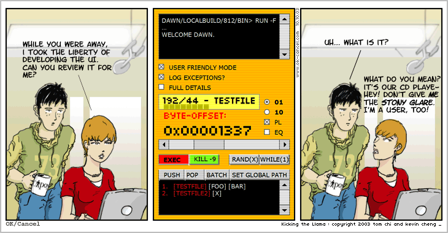
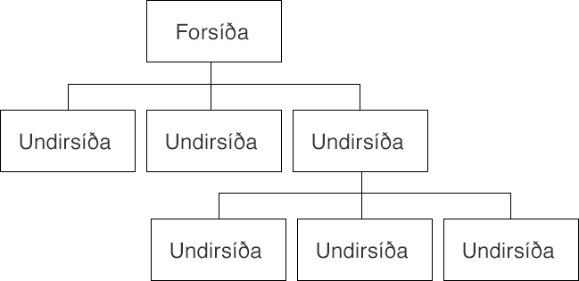

# Fyrirlestur – Hönnun

## Vefforritun 1 — TÖL107G

### Ólafur Sverrir Kjartansson, [osk@hi.is](mailto:osk@hi.is)

---

## Hönnun

* Þó að við lítum ekki á okkur sem „hönnuði“ getum við lært að búa til útlit sem eru fín
* Vefforritarar lenda oft í því að þurfa að hanna útlit, þó lítið sé
* Viljum forðast að búa til „forritaraútlit“

***

***

## Röðun og jöfnun (alignment)

* Röðun og jöfnun skiptir máli
* Ættum að leggja okkur fram við að setja hluti skipulega upp með reglu
* Notkun á grind hjálpar mikið!
* Bil ættu ekki að vera handahófskennd heldur fylgja reglu
* [Dæmi](daemi/01.alignment.html)

***

## Hópun

* Þegar við erum að skipuleggja efni er mikilvægt að huga að hópun
* Hlutir sem eiga að vera saman ættu að vera saman og ættu að vera líkir
* Þetta getur átt við allt frá listum, til upplýsinga í fæti til mynda og texta tengdum þeim
* [Dæmi](daemi/02.proximity.html)

***

## Andstæður (contrast)

* Andstæður  myndast þegar hlutir eru ólíkir, ekki aðeins ólíkir heldur mjög ólíkir
* Með þvi getum við dregið athygli að ákveðnum hlutum og brotið upp hönnun

***

* Andstæður er hægt að mynda með letri: mismunandi leturgerð, mismunandi þyngd eða mismunandi stærð.
* Eða litum: með því að snúa við litum á bakgrunni og letri
* [Dæmi](daemi/03.contrast.html)

***

## Letur

* Vöndum val á leturgerðum
  * Ekki allar leturgerðir eru ekki gerðar til þess að vera á meginmáli eða fyrirsögnum
* Veljum leturgerðir sem bjóða upp á andstæður!
* Stærðir á letri ættu ekki að vera handahófskenndar
  * Getum skilgreint _týpografískan skala_, t.d. `12 14 16 18 21 24 36 48`

***

## Litir

* Ættum að ákveða litapallettu og nota hana
* Margar leiðir til að velja liti, gott að nota tól
  * [Adobe Color](https://color.adobe.com/)
  * [Sessions collage: Color Calculator](https://www.sessions.edu/color-calculator/)

***

## Veftré

* Áður en við förum beint _að hanna_ vef er mikilvægt að greina umfangi
* Til þess að komast að því er gott að byrja á að því að setja upp _veftré_
  * Yfirlitsmynd yfir allar síður vefsins og hvernig þær tengjast innbyrðist

***

***

## Wireframe

* Wireframe er það að taka hverja síðu/„síðutýpu“ og skissa upp hvernig hún mun líta út
* Blað og blýanti, á tússtöflu eða í tóli (t.d. [balsamiq](https://balsamiq.com/))
* Þetta gefur okkur tilfinningu fyrir því hvaða efni þurfi að vera á hverri síðu, í hvaða forgangi það eigi að vera og hvernig það tengist öðru efni

***

---

## Að vinna með hönnuðum

* Yfirleitt vinnum við með hönnuðum að því að útfæra vef
* Samstarf! Forritarar eru ekki bara „verkfæri“ sem útfæra hannaðan vef
* Eigum að ýta á og biðja um útskýringar

***

## Mismunandi stöður

* Þegar við útfærum þurfum við að [hugsa um marga hluti](https://medium.com/swlh/the-nine-states-of-design-5bfe9b3d6d85)
* Sérstaklega ef hægt verður að setja inn allskonar efni

***

* Hvernig lítur þetta út tómt?
* Meðan verið er að sækja efni?
* Ef það er of mikið af efni, hvort sem það eru löng orð, of mörg orð, of mikið af hlutum?
* Hvað ef það kemur upp villa? Hvað með þegar það er búið að framkvæma aðgerð?

---

## Figma

* Flestir vefhönnuðir vinna í [Figma](https://www.figma.com/) í dag
  * En samt líka [Sketch](https://www.sketch.com/), eða kannski Photoshop
* _Mjög_ kraftmikið tól! Hannað út frá þörfum vefhönnunar
* Vefhönnunartól á vefnum

***

* [Hönnunarkerfi island.is](https://island.is/frett/hoennunarkerfi)
  * [Figma](https://www.figma.com/@islandis)
  * [„Storybook“ með útfærðri virkni](https://ui.devland.is/)
