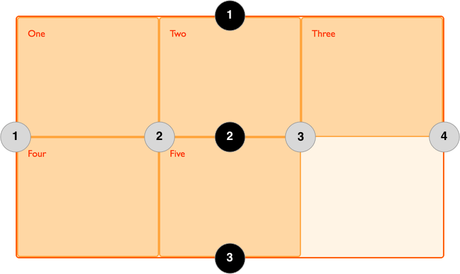

# Fyrirlestur — CSS grid

## Vefforritun 1 — TÖL107G

### Ólafur Sverrir Kjartansson, [osk@hi.is](mailto:osk@hi.is)

---

## Grid

* CSS grid er notað til að skilgreina skipulag (e. layout) á síðu
* Skipuleggjum í röðum og dálkum
* Svipað hugtak og þegar síður voru skipulagðar með `<table>`... en sérhannað til þess

***

* Getum skilgreint með nákvæmum (`px`) eða hlutfallslegum einingum
* Skilgreinum raðir og dálka sem mynda _grid tracks_ og _grid lines_
* Staðsetjum hluti (items) á grid út frá þessum tracks og lines

***

## Grid tracks & line

* Grid line er _lína_ í grid sem er talin frá byrjun (frá `1`!) að enda fyrir raðir og dálka
* Grid track er plássið á milli lína og er plássið þar sem hlutir lenda, bæði fyrir raðir og dálka

***



Grid með 4 dálka line (talið innan gráu hringja) og 3 raða line (innan svörtu hringja).

Grid hefur 3 dálka track og 2 raða track.

***

## Skilgreining á grid

* Skilgrinum _explicit_ grid með [`grid-template-columns`](https://developer.mozilla.org/en-US/docs/Web/CSS/grid-template-columns) og [`grid-template-rows`](https://developer.mozilla.org/en-US/docs/Web/CSS/grid-template-rows)
* _implicit_ grid er skilgreind með því að setja `none` (sem er sjálfgefið gildi)
  * Grid track eru búin til eftir þörfum, eftir því hve mikið efni er í hlutum innan grid

***

* Getum stýrt hvernig stærð er útfærð í implicit grid með [`grid-auto-rows`](https://developer.mozilla.org/en-US/docs/Web/CSS/grid-auto-rows) og [`grid-auto-columns`](https://developer.mozilla.org/en-US/docs/Web/CSS/grid-auto-columns)
* Getum blandað implicit og explicit grid

***

## Gildi

* [`fr`](https://developer.mozilla.org/en-US/docs/Web/CSS/flex_value), ný hlutfallsleg eining fyrir _fraction_ af plássi, hagar sér svipað og þegar við setjum `flex-grow`
* [`min-content`](https://developer.mozilla.org/en-US/docs/Web/CSS/min-content), fyrir minnstu breidd efnis
* [`max-content`](https://developer.mozilla.org/en-US/docs/Web/CSS/max-content), fyrir hámarks breidd efnis

***

* [`minmax()`](https://developer.mozilla.org/en-US/docs/Web/CSS/minmax()), fall sem velur min eða max gildi
* [`repeat()`](https://developer.mozilla.org/en-US/docs/Web/CSS/repeat()), fall sem leyfir að skilgreina mörg

***

## Staðsetning á hlutum á grid

* [`grid-column`](https://developer.mozilla.org/en-US/docs/Web/CSS/grid-column), shorthand fyrir [`grid-column-start`](https://developer.mozilla.org/en-US/docs/Web/CSS/grid-column-start) og [`grid-column-end`](https://developer.mozilla.org/en-US/docs/Web/CSS/grid-column-end)
* `grid-column-start` skilgreinir hvar hlutur byrjar, eða hversu mörg spannar með `span`
* `grid-column-end` skilgreinir hvar hlutur endar, eða hversu mörg spannar

***

## `gap`

* [`gap`](https://developer.mozilla.org/en-US/docs/Web/CSS/gap) shorthand fyrir [`row-gap`](https://developer.mozilla.org/en-US/docs/Web/CSS/row-gap)  og [`column-gap`](https://developer.mozilla.org/en-US/docs/Web/CSS/column-gap)
* Stærð á bilum (_gutter_) milli dálka og raða

***

## `grid-template-areas`

* Getum gefið svæðum á grid nöfn til að einfalda staðsetningu
* [`grid-template-areas`](https://developer.mozilla.org/en-US/docs/Web/CSS/grid-template-areas) tekur við strengjum með bilum sem mynda nefnd svæði
* [`grid-area`](https://developer.mozilla.org/en-US/docs/Web/CSS/grid-area) tekur við heiti svæðis

```css
grid-template-areas: "a a a"
                     "b c c"
                     "b c c";
```

***

## Dæmi

* [Grid](daemi/01.grid-basic.html)
* [Jen Simmons: Intro to CSS grid](https://labs.jensimmons.com/#intro-grid)
* [Flexbox grid útfært með CSS grid](daemi/02.grid.html)
* [CSS grid areas](daemi/03.grid-areas.html)
* [Responsive CSS grid](daemi/04.grid-rwd.html)
