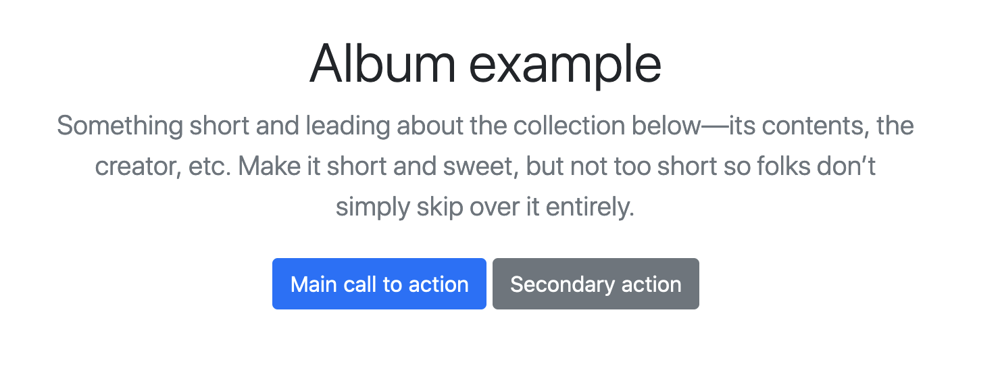
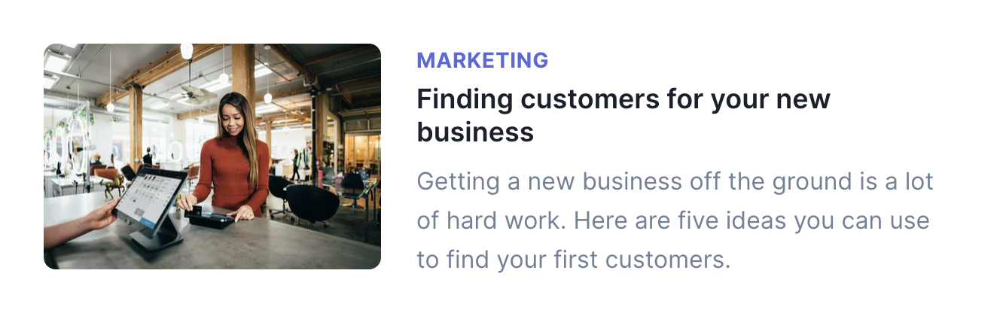

# Fyrirlestur 6.1 – CSS í stærri verkefnum

## Vefforritun 1 — TÖL107G

### Ólafur Sverrir Kjartansson, [osk@hi.is](mailto:osk@hi.is)

---

## CSS í stærri verkefnum

* Í byrjun eru CSS skrárnar okkar einfaldar og við höfum yfirsýn
* Þurfum ekki að bæta miklu við áður en þær verða flóknar
* Getum endað með „append only stylesheets“
  * Þorum bara að bæta við nýju CSS neðst

***

```css
/* reglur skilgreindar beint á type */
button { }
```

```css
/* önnur tegund notar class selector */
.button { }
```

```css
/* enn önnur type og class */
button.button { }
```

```css
/* eða önnur, óljós nöfn */
.button2 { }
```

***

## CSS viðmiðunarreglur

Í stærri verkefnum ættum við að setja okkur viðmiðunarreglur (guidelines)

* Hvernig nefnum við og skiptum upp hlutum?
* Hvernig skrifum við selectora?
* Hvernig högum við layout? Notum við grind?
* o.s.fr.

***

## Nokkrar tilbúnar aðferðir

* [SMACSS](http://smacss.com/) – _Scalable and Modular Architecture for CSS_
* [OOCSS](https://www.smashingmagazine.com/2011/12/an-introduction-to-object-oriented-css-oocss/) – _Object oriented CSS_
* [SUIT CSS](https://suitcss.github.io/) – _Style tools for UI components_
* [BEM](http://getbem.com/) – _Block Element Modifier_

***

## BEM

Leið til að nota selectora

* _Block_ - hæsta stig á _component_, foreldrið, t.d. `.button`
* _Element_ - börn undir _block_, t.d. `.button__price`
* _Modifier_ - breytir block án þess að hafa áhrif almennt, t.d. `.button--wide`

[BEM Dæmi](daemi/1.css-verkefni/01.bem.html)

---

## Skipulag og layout

* Í stærri verkefnum er mjög æskilegt að útbúa kerfi um hvernig við setjum upp layout
* Hönnunarkerfi skilgreina hvernig hönnun og forritun vinna saman
* Mismunandi hvernig sett upp, ein leið er [_atomic design_](https://bradfrost.com/blog/post/atomic-web-design/)

***


---

## Prófanir og stuðningur

* Hvaða vafra ætlum við að styðja?
  * [IE11 með 0,58% markaðshlutdeild hnattrænt](http://gs.statcounter.com/browser-market-share/all/worldwide/2020)?
* Hvað segja analytics gögn?
* Hver er krafa verkefnis eða viðskiptavinar?

***

## Prófanir í öllum vöfrum

* Við forritum vefina okkar yfirleitt í uppáhalds vafranum okkar
  * Góð _developer tools_ skipta máli
* Ekki allar vafrir standa jafnfætis
  * Mismunandi stuðningur og mismunandi böggar

***

## Fyrsta skrefið er að vera með plan

* Getum athugað væntan notendahóp eða skoðað heimsóknartölur
* Gott að hafa aðgang í alvöru tæki en líka til þjónustur eins og [Browserstack](https://www.browserstack.com/)
* Prófum í alvöru tækjum eins og við getum

---

## Hönnun

* Best er að hafa hönnuð í teyminu
* Ef ekki, þá þurfum við að hanna
* Eða a.m.k. finna leið til að „redda“ hönnun

***

## Bootstrap

* [Bootstrap](https://getbootstrap.com/) er _framenda hlutasafn_ (frontend component library)
* Fyrsta, stóra „frontend toolkit“
* Notum ákveðna klasa í HTML og fáum smekklegt útlit án mikils tilkostnaðar
* Nema að vefurinn okkar er frekar líkur frekar mörgum vefjum...

***

```html
<section class="py-5 text-center container">
  <div class="row py-lg-5">
    <div class="col-lg-6 col-md-8 mx-auto">
      <h1 class="fw-light">Album example</h1>
      <p class="lead text-muted">Something short and leading about the collection below—its contents, the creator, etc. Make it short and sweet, but not too short so folks don’t simply skip over it entirely.</p>
      <p>
        <a href="#" class="btn btn-primary my-2">Main call to action</a>
        <a href="#" class="btn btn-secondary my-2">Secondary action</a>
      </p>
    </div>
  </div>
</section>
```

***



***

## Material

* [Material](https://material.io/) er hönnunarkerfi frá Google
* Mjög yfirgripsmikið og þroskað hönnunarkerfi
* Útfærslur fyrir vef, Android, iOS, og Flutter

***

## Tailwind

* [Tailwind](https://tailwindcss.com/) CSS framework sem byggir á að nota hjálparklasa (utility classes)
* Fáum ekki tilbúna hluti, setjum þá saman með allskonar klösum
* Orðið frekar vinsælt og mikið notað
* Mæli með að læra CSS vel _áður_ en farið er að nota það

***

```html
<div class="md:flex">
  <div class="md:flex-shrink-0">
    
  </div>
  <div class="mt-4 md:mt-0 md:ml-6">
    <div class="uppercase tracking-wide text-sm text-indigo-600 font-bold">Marketing</div>
    <a href="#" class="block mt-1 text-lg leading-tight font-semibold text-gray-900 hover:underline">
      Finding customers for your new business
    </a>
    <p class="mt-2 text-gray-600">
      Getting a new business off the ground is a lot of hard work.
      Here are five ideas you can use to find your first customers.
    </p>
  </div>
</div>
```

***


