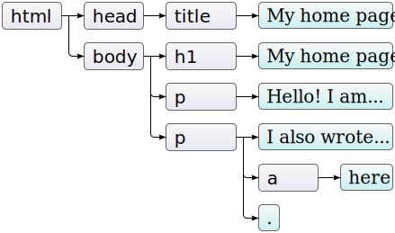
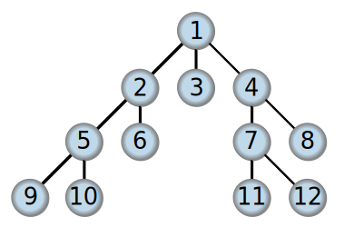

# Fyrirlestur – DOM & vafrinn

## Vefforritun 1 — TÖL107G

### Ólafur Sverrir Kjartansson, [osk@hi.is](mailto:osk@hi.is)

---

## HTML & JavaScript

Í æskilegri röð:

1. `<script src="scripts.js"></script>`
2. Innan `<script>...</script>`
3. Forðast að binda JavaScript við element með on* attributes (t.d. `onclick`)

***

## Að teikna síðu

HTML, CSS og JavaScript er ekki sótt á augabragði, í einfaldaðri mynd gerist:

* HTML er sótt
* HTML er þáttað (parsed)
* Hvert `<script>` er sótt, þáttað og keyrt (annað bíður!)

***

* Hvert `<link rel="stylesheet">` er sótt og þáttað
* HTML þáttun líkur
* Síða er teiknuð

***

## Skilvirkar skriptur

* Þegar vafri les síðu og rekst á `<script>` sækir hann skjalið og keyrir en _bíður á meðan með að teikna síðu_
* Ef við merkjum með `<script async>` er skjalið sótt _async_ og keyrt um leið og hægt er

***

* Getur skipt miklu máli og orðið frekar flókið, en almenn regla, ef við erum ekki að nota `type="module"`:
  * Setjum `<script>` rétt áður en við lokum `<body>`
  * Í réttri röð—ef `b.js` þarf eitthvað úr `a.js` setjum við `a.js` fyrst

***

* Viljum að allt HTML sé sótt og eins mikið af síðu teiknuð áður en við vinnum úr JavaScript
* Þetta er einföldun, ef við erum virkilega að hugsa um performance þarf að skoða þetta fyrir hvert verkefni

---

## DOM

* [Document Object Model](https://developer.mozilla.org/en-US/docs/Web/API/Document_Object_Model)
* Leyfir forritum og skriptum að gera dýnamískar breytingar á efni, skipulagi og útliti skjala (oftast HTML eða XML) gegnum API
* Hlutlaust á platform og mál
* Staðlað af [W3C](http://www.w3.org/DOM/)

***

```html
<!doctype html>
<html>
  <head>
    <title>My home page</title>
  </head>
  <body>
    <h1>My home page</h1>
    <p>Hello, I am Marijn and this is my home page.</p>
    <p>I also wrote a book! Read it
      <a href="http://eloquentjavascript.net">here</a>.
    </p>
  </body>
</html>
```

***


***

## `window`

* Stendur fyrir _gluggann_ sem inniheldur DOM tréð
* _Umhverfið_ sem forritin okkar eru keyrð í
* Heldur utan um global scope
* Hver gluggi eða tab í vafra hefur eigið `window`

***

## HTML

* Nálgumst DOM í gegnum `document` hlutinn á `window`
* Hvert element er _nóða_ (node) í _DOM tré_
  * `nodeType` segir til um gerð nóðu, t.d. `1` er `ELEMENT_NODE`, `3` er `TEXT_NODE`
  * Fastarnir skilgreindir á `Node`, t.d. `Node.ELEMENT_NODE`

***

* `document.documentElement` okkur aðgang að _rót DOM trés_, `<html>`
* `document.body` gefur okkur aðgang að _hluttré_ sem byrjar undir `<body>`
* Tré er gagnatag með skilgreinda rót og enga hringi, nóða inniheldur ekki sjálfa sig
  * Hluttré er tré innan trés, veljum aðra nóðu sem rót

***



***

## DOM staðall

* DOM forritunarskilin eru ekkert sérstaklega góð
  * Ekki útbúin fyrir JavaScript heldur fyrir almenna vinnslu á XML
* Einhverjir kostir að nota sömu skil en eiginlega ekki næg...

***

Dæmi um óþægindi:

* Tölur notaðar fyrir gerðir nóða
* Erfitt að búa til nýjar nóður, þurfum óþarflega margar línur af kóða
* Gögnum er skilað sem `NodeList` sem er næstum því array, en samt ekki

***

## Ferðast um DOM

Hver nóða hefur vísanir í foreldri, börn og systkini:

* `parentNode` – foreldri nóðu
* `childNodes` – fylki af börnum nóðu
* `lastChild` – seinasta barn nóðu
* `previousSibling` –  fyrra systkini nóðu
* o.fl.

***


***

* Getum notað lykkjur og _endurkvæmni_ til að ferðast um tréð
* Ítrum gegnum `childNodes` og athugum hvort börn séu `ELEMENT_NODE`, höldum þá áfram
* `childNodes` er `NodeList`

***

## NodeList

* `NodeList` er ekki alvöru fylki, getum breytt í array með `Array.from()`
* Er stundum _lifandi_ hlutur: ef DOM breytist og nóðu er eytt eða bætt við, bætist hún við eða er fjarlægð úr hlut

***

<!-- eslint-disable no-restricted-syntax -->

```javascript
function walk(node) {
  const {
    childNodes, nodeType, nodeValue,
  } = node;

  if (nodeType === Node.ELEMENT_NODE) {
    for (const child of Array.from(childNodes)) {
      walk(child);
    }
  } else if (nodeType === Node.TEXT_NODE) {
    console.log(`Textanóða: ${nodeValue}`);
  }
}

walk(document.body);
```

***

[Dæmi](daemi/01.travel.html)

***

## Finna element

* Oftast þurfum við að finna ákveðin element, ekki ítra gegnum þau öll
* `document` og `element` hafa föll sem leyfa okkur að leita eftir ýmsum leiðum

***

## getElementById

* Finnur _eitt_ element eftir `id` (því `id` er einkvæmt á síðu!)
* `document.getElementById('main')` til að leita á allri síðu
* `element.getElementById('main')` til að finna undir ákveðnu `element`

***

## getElementsByTagName

* Finnur mörg element eftir nafni tags og skilar _lifandi_ `NodeList`
* `document.getElementsByTagName('a')` til að leita á allri síðu
* `element.getElementsByTagName('a')` til að finna undir ákveðnu `element`

***

## getElementsByClassName

* Finnur mörg element eftir `class` og skilar _lifandi_ safni
* `document.getElementsByClassName('list')` til að leita á allri síðu
* `element.getElementsByClassName('list')` til að finna undir ákveðnu `element`

***

## querySelector

* [`querySelector`](https://developer.mozilla.org/en-US/docs/Web/API/Document/querySelector) leitar eftir **CSS selector** að _fyrsta_ elementi sem passar (dýpt fyrst)
* `document.querySelector('.important')` til að leita á allri síðu
* `element.querySelector('.important')` til að finna undir ákveðnu `element`

***

## Leitað í trjám

* Þegar við leitum í trjám er tvennt í boði:
  * _Dýpt first_ (depth first), farið eins djúpt og hægt er á grein áður en næsta grein er skoðuð
  * _Breidd fyrst_ (breadth first), farið eins breitt og hægt er áður en farið er að skoða börn greinar

***

## Depth first


***

## Breadth first



***

## querySelectorAll

* [`querySelectorAll`](https://developer.mozilla.org/en-US/docs/Web/API/Document/querySelectorAll) leitar eftir CSS selector að _öllum_ elementum sem passar
* Skilar _statsískum_ `NodeList`, ekki lifandi
* `document.querySelectorAll('div')` til að leita á allri síðu
* `element.querySelectorAll('div')` til að finna undir ákveðnu `element`

***

**Notum `querySelector` og `querySelectorAll` lang mest þegar við erum að leita að elementum.**

**Samlegðaráhrif á milli CSS og JavaScript gegnum selectora!**

***

[Dæmi](daemi/02.find.html)

---

## Breytingar á DOM tré

* Nóður hafa föll sem leyfa okkur að breyta uppsetningu trés, t.d.:
  * `removeChild` – fjarlægir barn
  * `appendChild` – bætir við barni á nóðu, aftast
  * `insertBefore` – bætir við barni á nóðu, á undan tilgreindu barni

***

```html
<p>One</p>
<p>Two</p>
<p>Three</p>
```

<!-- eslint-disable operator-linebreak -->

```javascript
const paragraphs =
  document.body.getElementsByTagName('p');

document.body.insertBefore(
  paragraphs[2],
  paragraphs[0],
);
```

***

## Að búa til element

* `document.createElement(element)` – býr til nýtt element sem við getum átt við
* `document.createTextNode(text)` – býr til texta nóðu
* Notum síðan föll á node til að bæta við DOMið, t.d. `appendChild`

***

```javascript
const p = document.createElement('p');

p.setAttribute('class', 'hello');
const txt = document.createTextNode('Hæ!');
p.appendChild(txt); // bætum texta við p

// bætum p við, aftast í body
document.documentElement
  .lastChild.appendChild(p);
```

***

## Attributes

* `setAttribute(attribute, value)` – setur attribute á elementi
* `getAttribute(attribute)` – sækir attribute á element
  * Virkar þó ekki fyrir öll attribute, t.d. `value` á input
* Sum almenn attribute eru aðgengileg með property, t.d. `className` fyrir `class` (`class` er frátekið orð!)

***

<!-- eslint-disable operator-linebreak, no-unused-expressions -->

```javascript
const input =
  document.createElement('input');

input.setAttribute('type', 'text');
input.setAttribute('id', 'searchField');
input.setAttribute('required', true);
input.setAttribute('value', 'foo');

// gildi breytt í "foobar" í input
input.getAttribute('value'); // "foo"
input.value; // "foobar"
```

***

[Dæmi um að færa til element](daemi/03.change.html)

[Dæmi um að búa til element](daemi/04.create.html)

[Dæmi um attribute](daemi/05.attribute.html)

***

## Hjálparföll

* Heldur mikið sem þarf að gera
  * Búa til element
  * Búa til texta element og bæta því við
  * Bæta element við element/document
* Getum útbúið okkur hjálparföll

***

<!-- eslint-disable no-unused-vars, no-restricted-syntax -->

```javascript
function el(name, ...children) {
  const e = document.createElement(name);

  for (const child of children) {
    if (typeof child === 'string') {
      e.appendChild(
        document.createTextNode(child),
      );
    } else {
      e.appendChild(child);
    }
  }

  return e;
}
```

***

<!-- eslint-disable no-undef, function-paren-newline -->

```javascript
document.body.append(
  el('div',
    el('p', 'Halló heimur!'),
    el('ul',
      el('li', 'einn'),
      el('li', 'tveir'),
      el('li', 'þrír'),
    ),
  ),
);
```

***

```html
<div>
  <p>Halló heimur!</p>
  <ul>
    <li>einn</li>
    <li>tveir</li>
    <li>þrír</li>
  </ul>
</div>
```

***

[Dæmi](daemi/06.helper.html)

---

## Geyma gögn á elementum

* Stundum þurfum við að geyma gögn á elementi og það er engin merkingarfræðileg leið til þess
* Nýtum [data attributes](https://developer.mozilla.org/en-US/docs/Web/API/HTMLElement/dataset), lágstafa attribute á element sem byrja á "`data-`", t.d.  `data-foo`
* Getum nálgast gegnum JavaScript
  * `el.dataset.foo`

***

[Dæmi](daemi/07.data.html)

---

## Classlist

* Ef við viljum eiga við `class` á element er hentugast að nota [`classList`](https://developer.mozilla.org/en-US/docs/Web/API/Element/classList)
* Hefur aðferðir til að breyta `class` án þess að fara í strengjaleikfimi
  * Getum nálgast `class` sem streng gegnum `className`

***

* `element.classList.add` bætir við class ef hann er ekki til staðar
* `element.classList.remove` fjarlægir class ef hann er til staðar
* `element.classList.toggle` bætir við ef ekki, annars fjarlægir

***

<!-- eslint-disable operator-linebreak, no-undef -->

```javascript
const div =
  document.createElement('div');

div.classList.add('text');
div.classList.add('important');
// class="text important"
```

<!-- eslint-disable no-undef -->

```javascript
div.classList.remove('text');
div.classList.toggle('important');
// class=""
```

<!-- eslint-disable no-undef -->

```javascript
div.classList.toggle('important');
// class="important"
```

***

## JavaScript og CSS

* Við getum breytt CSS beint á elementi
* Höfum aðgang að `style` hlut á nóðu, `node.style`
* Yfirleitt viljum við ekki gera það
  * Bókstaflega setur stíla á element eins og með `style` attribute

***

* Betra að breyta því hvaða `class` eru á element
* Viðheldur samræmi milli JavaScript virkni og CSS
  * Ef það á að breyta útliti, skilgreinum með CSS og eigum við `class`

***

<!-- eslint-disable no-unused-expressions -->

```javascript
const div = document.querySelector('div');

// hlutur með öllum stílum á div
div.style;

// setjum margin á div
div.style.margin = '10px 20px 30px 10px';
```

***

[Dæmi](daemi/08.styles.html)

---

## Uppfæra textanóður

* [`textContent`](https://developer.mozilla.org/en-US/docs/Web/API/Node/textContent) er eigindi á node sem leyfir okkur að lesa allan texta nóðu _eða_ setja texta nóðu
* Ef við lesum fáum við texta nóðu, ef hún á önnur börn fáum við einnig texta þeirra
* Ef við setjum texta, setjum við *allt* efni nóðu sem textann—fjarlægjum öll börn

***

* [`innerText`](https://developer.mozilla.org/en-US/docs/Web/API/HTMLElement/innerText) er svipað, nema það skilar aðeins sýnilegum (lesanlegum) texta
* [`innerHTML`](https://developer.mozilla.org/en-US/docs/Web/API/Element/innerHTML) skilar HTML nóðu eða setur efni nóðu _sem HTML_
  * Ættum að forðast og nota aðeins ef við verðum, það eru [öryggisáhættur](https://developer.mozilla.org/en-US/docs/Web/API/Element/innerHTML#security_considerations) og [performance mál](https://developer.mozilla.org/en-US/docs/Web/API/Node/textContent#differences_from_innerhtml) þar sem allt efni er þáttað sem HTML áður en sett inn

***

[Dæmi](daemi/09.text.html)

---

## Layout

* Við getum nálgast upplýsingar um stærðir á elementum á síðu á ýmsa vegu
* `offsetWidth` og `offsetHeight` gefa okkur stærð á efni innan elements í pixlum
* `clientWidth` og `clientHeight` gefa okkur stærð á efni innan elements, án border í pixlum

***

* [`getBoundingClientRect()`](https://developer.mozilla.org/en-US/docs/Web/API/Element/getBoundingClientRect) skilar hlut með upplýsingum um hvar element er teiknað hlutfallslega á síðu
* `pageXOffset` og `pageYOffset` á `window` gefa okkur upplýsingar um hversu mikið er búið að skruna (scrolla) síðu

***

[Dæmi](daemi/10.sizes.html)

***

## Layout og repaint

* Þegar við biðjum um [staðsetningar á hlutum í gegnum JavaScript getum við _triggerað repaint_](https://gist.github.com/paulirish/5d52fb081b3570c81e3a)
  * Vafri þarf að teikna síðu aftur til að vera viss um allar staðsetningar
* Ekki ódýrt, tekur einhverjar millisekúndur eftir því hversu þung síða er
* Mjög dýrt ef við gerum innan lykkju

***

[Dæmi](daemi/11.repaint.html)

---

## Animation og JavaScript

* Stundum þurfum við að útfæra flóknari animations þar sem CSS er ekki nóg
* Sér verkefni að læra og æfa það
* En almennt gilda sömu reglur, nota `opacity` og `transform`
  * Forðast að kalla í föll sem láta vafra keyra repaint

***

## requestAnimationFrame

* [`requestAnimationFrame`](https://developer.mozilla.org/en-US/docs/Web/API/window/requestAnimationFrame) keyrir fall á þeim tíma þegar vafri er að fara að teikna útlit
* Keyrir yfirleitt á 60 fps, eða á _refresh rate_ í vafra
* Eitt argument, `DOMHighResTimestamp`, sem segir til um hvað klukkan er, nákvæmt niður á `1ms`

***

[Dæmi](daemi/12.animation.html)
