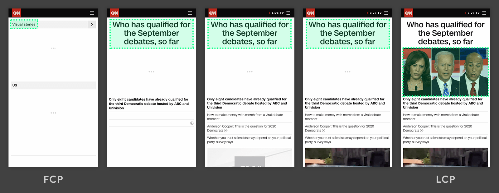
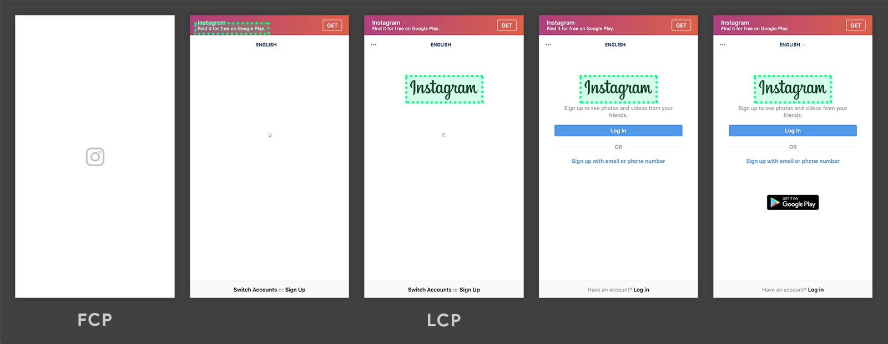

# Fyrirlestur – Prófanir

## Vefforritun 1 — TÖL107G

### Ólafur Sverrir Kjartansson, [osk@hi.is](mailto:osk@hi.is)

---

## Sjálfvirkar prófanir

* Þegar við skrifum kóða erum við alltaf að athuga hvernig hann virkar
* Gerum það yfirleitt handvirkt
* Getum eytt tíma og skrifað próf fyrir þessa handvirku athugun
* Höfum séð aðeins með `console.assert()`

***

## Kostir prófa

* Getum keyrt mörg próf hratt, aftur og aftur
* „Notum“ kóðann okkar á meðan við skrifum hann, getum endað með betra API
* Gefur okkur ákveðið traust á virkni og að við munum ekki brjóta hana seinna meir

***

## Ókostir prófa

* Það tekur töluvert lengri tíma að skrifa próf en að athuga eitthvað handvirkt _í fyrstu_
* Geta gefið okkur _falskt_ öryggi um að það séu ekki villur í kóðanum okkar því við skrifuðum próf
* Við breytingar á kóða þarf að uppfæra próf
  * ef það er erfitt er mun auðveldara að slökkva bara á þeim

***

## Unit test

* [Unit test](https://en.wikipedia.org/wiki/Unit_testing) er ekki vel skilgreint hugtak en..
* Próf á einni einingu í einu án þess að horfa á alla heildina
  * Eining gæti verið fall, klasi, módull
* Sumir segja að unit test eigi _ekki_ að snerta á I/O (fara yfir net, lesa af disk) eða einhverju fyrir utan einingu

***

* Hjálpa okkur við að komast að því hvernig við viljum smíða forritið okkar
* Fáum endurgjöf hratt og örugglega meðan við erum að skrifa
* Leyfa okkur að breyta kóða með vissu öryggi — erum með próf til staðar sem grípa villur

***

* Prófin geta komið í stað eða aukið við skjölun, sýna bókstaflega hvernig kerfið virkar
* Fyrir villur sem finnast getum við skrifað próf áður en við lögum
  * Minnkum líkur á að villa komi upp aftur

***

## Skilvirk test

* Einföld & DRY (Don't Repeat Yourself)
  * Einn hlutur í einu
* Óhað röð sem þau eru keyrð í
* Endurtakanleg (repeatable) með sömu niðurstöðum
* _Hröð_, viljum ekki vera að bíða eftir keyrslu, eiga helst að keyra undir 1 sek

***

## Assertions — staðhæfingar

* Við skrifum prófin okkar þ.a. þau staðhæfi eitthvað í lokin
  * Við gefum rétt gildi og athugum hvort það sé eins
  * `assert(result === 'foo');`
* Ættum að hafa færri en fleiri staðhæfingar í hverju prófi
* Ein leið til að skipuleggja próf er að fylgja [_arrange, act, assert_](http://wiki.c2.com/?ArrangeActAssert)

***

## Arrange, Act, Assert

```javascript
const input = 'bar';           // Arrange

const result = reverse(input); // Act

assert(result === 'rab');      // Assert
```

***

## Test-driven development (TDD)

Í [Test-driven development (TDD)](https://en.wikipedia.org/wiki/Test-driven_development) ítrum við:

1. Skrifum próf sem bregst
2. Skrifum kóða sem lætur öll prófi heppnast
3. Hreinsum/refactorum kóða og keyrum próf

***


***

## Jest

* [Jest](https://jestjs.io/) er JavaScript testing framework
* Virkar með allskonar, t.d.: JavaScript, React, TypeScript, Node
* Sækjum með
  * `npm install --save-dev jest`

***

```javascript
import { describe, expect, it } from '@jest/globals';
import { reverse } from '../src/lib/reverse.js';

describe('main.js', () => {
  it('should reverse a string', () => {
    const input = 'bar';

    const result = reverse(input);

    expect(result).toBe('rab');
  });
});
```

***

Til að geta prófað kóða skrifaðann fyrir JavaScript modules, þurfum við að:

* Setja `"type": "module"` í `package.json`
* Keyra með Node með flagginu `--experimental-vm-modules` sem kveikir á stuðning
  * `"test": "NODE_OPTIONS='--experimental-vm-modules' jest ./test/*.js"`

---

## Continuous integration

* [Continuous integration (CI)](https://en.wikipedia.org/wiki/Continuous_integration) er þegar við keyrum öll test við hvert commit í source control
* „Integration“ kemur frá því að við erum að _integratea_ við `main` branch
  * Ef það er gert sjaldan getur komið upp staða þar sem gefa á út og það þarf að mergea mörgu í einu
  * _Integration hell_
* Ákveðið traust á því að `main` sé alltaf tilbúið til útgáfu

***

## Continuous deployment

* [Continuous deployment (CD)](https://en.wikipedia.org/wiki/Continuous_deployment) er þegar við gefum `main` út á raunkerfi fyrir hverja breytingu sem stenst próf
* Höldum `main` alltaf í _deployable_ ástandi
* Hægt að gefa út oft á dag
* Netlify uppsetningar, eins og við höfum verið að nota þær, nýta continuous deployment

***

## Netlify

* Getum stillt þannig að Netlify keyri prófin okkar _áður_ en gefið út
* Svo lengi sem testin okkar grípa ákveðnar villur, munu þær ekki komast út á raunkerfi
* Fáum aukið öryggi í continuous deployment ferlið okkar

***

[Netlify CI dæmi](https://github.com/vefforritun/vef1-2021-netlify-ci)

---

## Önnur tól

* Að nota sjálfvirk próf er gott, en oft þurfum við líka að nota „handvirk“ próf
* Höfum notað í haust: HTML validator, Jigsaw CSS validator, aXe

***

## Performance atriði

Hversu „performant“ vefirnir okkar er margþætt verkefni sem snertir á öllu sem viðkemur vefforritun, t.d.

* Hvaða forritunarumhverfi við notum í bakenda
* Hvernig við útfærum bakenda, t.d. tengingar við gagnagrunn og vefþjónustur
* Hversu hratt við skilum efni á framenda

***

* Hvaða forritunarumhverfi við notum á framenda
* Hve mikið af JavaScript við hlöðum inn
* Hve mikið af efni (myndum, myndböndum) við vísum í
* Hvort við séum að nota CDN
* o.fl.

---

## Core Web Vitals

* [Core Web Vitals](https://web.dev/vitals/) eru mælistikur frá Google sem eiga að mæla hluti sem hafa raunveruleg áhrif á notendur
* Í dag eru þrír hlutir mældir

***

## Largest Contentful Paint (LCP)

* [Largest Contentful Paint (LCP)](https://web.dev/lcp/) mælir hversu langan tíma það tekur að birta „mikilvægasta“ efni síðu
  * Túlka mikilvægast sem stærsta
* Áður var oft mælt [First Meaningful Paint (FMP)](https://web.dev/first-meaningful-paint/) sem tímann sem það tók fyrsta efni vefs að birtast

***



***



***

## First Input Delay (FID)

* [First Input Delay (FID)](https://web.dev/fid/) mælir hversu langan tíma það tekur frá fyrstu gagnvirkni (interaction) þar til henni er svarað
* Þetta getur verið hægt í byrjun því verið er að sækja gögn, vinna úr þeim eða eiga við DOM

***

## Cumulative Layout Shift (CLS)

* [Cumulative Layout Shift (CLS)](https://web.dev/cls/) mælir hversu mikið efni á síðu færist til meðan verið er að klára að sækja öll gögn og teikna
* Efni sem færist mikið til getur verið afsakplega hvimleitt og valdið því að maður ýti vitlaust eða missi af efni

---

## Performance debug

* Ef við erum með hlut sem veldur hægagangi eða lækkar skor hjá okkur getur verið misauðvelt að laga þau
* [Performance debug](https://developer.chrome.com/docs/devtools/evaluate-performance/) tólið í Chrome er kraftmikið og getur hjálpað við að debugga þetta
  * Mjög mikið af upplýsingum og getur verið erfitt að átta sig á til að byrja með

***

## Tól

* [Lighthouse](https://developers.google.com/web/tools/lighthouse/) í Chrome keyrir allskonar próf, t.d. fyrir Core Web Vitals og „Best Practices“
* [PageSpeed Insights](https://developers.google.com/speed/pagespeed/insights/) bíður upp á að keyra svipuð próf á miðlægum þjón
* [WebPageTest](https://www.webpagetest.org/) keyrir hraðamælingar, hversu vel svör frá bakenda eru, CDN notkun o.fl.
